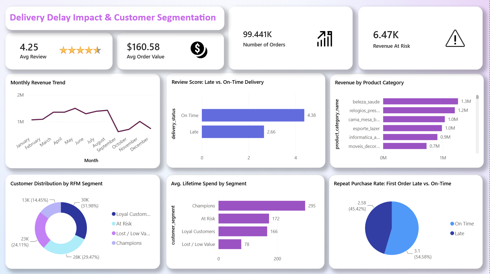

# E-Commerce Analytics: Delivery Delay Impact & Customer Segmentation

An end-to-end SQL analytics project analyzing 99K+ orders from the [Olist Brazilian E-Commerce dataset](https://www.kaggle.com/datasets/olistbr/brazilian-ecommerce), investigating whether late deliveries measurably hurt customer satisfaction and retention — and quantifying the revenue impact.

**[View the interactive Power BI dashboard screenshot](#dashboard)** | **[Jump to key findings](#key-findings)**

## Tech Stack
- **Database:** SQL Server 2025 (Docker)
- **Analysis:** T-SQL — CTEs, window functions (`RANK()`, `NTILE()`, `LAG()`, `ROW_NUMBER()`), multi-table joins
- **Visualization:** Power BI Desktop

## Dataset
9 relational tables, ~99,441 orders, ~1M+ total rows across orders, order items, payments, reviews, products, sellers, customers, and geolocation data from a Brazilian e-commerce marketplace (2016–2018).

## Methodology

1. **Setup** ([`01_create_tables.sql`](sql/01_create_tables.sql), [`02_bulk_insert.sql`](sql/02_bulk_insert.sql)) — Built the relational schema with foreign key constraints and bulk-imported all 9 source CSVs.
2. **Delivery delay analysis** ([`03`](sql/03_delivery_delay_view.sql), [`04`](sql/04_delay_vs_reviews.sql)) — Built a reusable view calculating delivery delay per order, joined against review scores.
3. **Retention analysis** ([`05`](sql/05_repeat_purchase_by_delivery.sql), [`06`](sql/06_first_order_delay_vs_repeat.sql)) — Tested whether a customer's *first* delivery experience predicts repeat purchase behavior, correcting for a reverse-causality confound found during analysis (see note below).
4. **Revenue quantification** ([`07`](sql/07_avg_order_value.sql)) — Calculated average order value to translate the retention gap into a dollar figure.
5. **RFM segmentation** ([`08`](sql/08_rfm_segmentation.sql), [`09`](sql/09_rfm_segment_summary.sql)) — Scored all ~93K customers on Recency, Frequency, and Monetary value using `NTILE()`, segmenting into Champions / Loyal / At Risk / Lost.
6. **Supplementary analyses** ([`10`](sql/10_monthly_revenue_trend.sql) monthly trend, [`11`](sql/11_seller_performance_ranking.sql) seller ranking, [`12`](sql/12_category_revenue.sql) category revenue).

## Key Findings

| Metric | Result |
|---|---|
| Orders analyzed | 99,441 across 9 tables |
| Late deliveries | 7,844 orders (8.1% of total) |
| Avg. review score — late orders | **2.66** / 5 |
| Avg. review score — on-time orders | **4.38** / 5 |
| Repeat purchase rate — late first order | 2.51% |
| Repeat purchase rate — on-time first order | 3.04% (**17% relatively higher**) |
| Average order value | $160.58 |
| **Estimated revenue at risk** | **~$6,470/year** |
| RFM: Champions avg. lifetime spend | $295 (**~4x** the Lost/Low Value segment) |

**Recommendation:** A proactive delivery-delay alert system, prioritized for high-RFM-value customers, since they are both the most valuable and the most exposed to churn risk from a poor first experience.

## A note on methodology (and a caught bug)

Two things worth calling out about how this analysis was actually built, not just its conclusions:

- **Confound correction:** An early version of the retention analysis measured "did this customer *ever* experience a late delivery," which turned out to be confounded — customers with more total orders were more likely to have *any* late delivery by pure chance, inverting the apparent relationship. The corrected analysis instead isolates each customer's *first* order specifically ([`06_first_order_delay_vs_repeat.sql`](sql/06_first_order_delay_vs_repeat.sql)), which properly separates cause from effect.
- **NTILE bug:** The RFM scoring initially had `NTILE()` sort directions inverted, causing top spenders to be scored as "worst" and labeled "Lost/Low Value." This was caught by sanity-checking that "Champions" showed a *higher* average spend than "Lost/Low Value" (it initially showed the reverse) and fixed in [`09_rfm_segment_summary.sql`](sql/09_rfm_segment_summary.sql).

## Dashboard

Built in Power BI, connecting live to the SQL Server database plus several precomputed query results (RFM, repeat-purchase rate, seller ranking) that use window functions not natively available in DAX.



## Repository Structure
```
├── README.md
├── images/
│   └── dashboard.png
└── sql/
    ├── 01_create_tables.sql
    ├── 02_bulk_insert.sql
    ├── 03_delivery_delay_view.sql
    ├── 04_delay_vs_reviews.sql
    ├── 05_repeat_purchase_by_delivery.sql
    ├── 06_first_order_delay_vs_repeat.sql
    ├── 07_avg_order_value.sql
    ├── 08_rfm_segmentation.sql
    ├── 09_rfm_segment_summary.sql
    ├── 10_monthly_revenue_trend.sql
    ├── 11_seller_performance_ranking.sql
    └── 12_category_revenue.sql
```

## Data Source
[Brazilian E-Commerce Public Dataset by Olist](https://www.kaggle.com/datasets/olistbr/brazilian-ecommerce) (Kaggle, CC BY-NC-SA 4.0)
